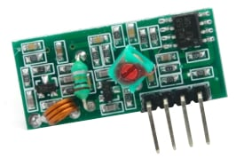
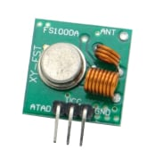
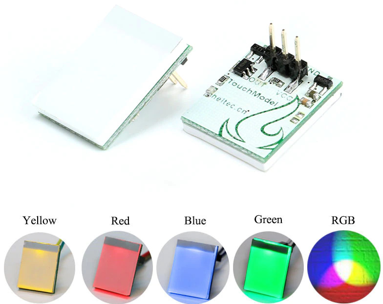
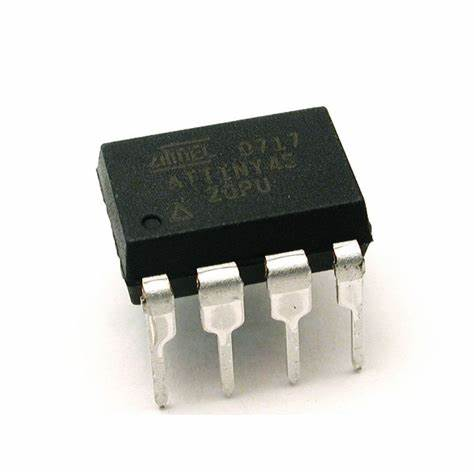

## A problem to solve
The basic problem that I needed to solve is to create a kind of door ring for our dog. He is called "Csipesz" in Hungarian, which means "Clips". He likes to touch everything with his nose to draw attention to himself instead of barking or do something with his legs. Which makes his life hard if he wants to come in.

### Buttons
Touching with nose is not a strong movement, so I could not use any button or micro switch. I decided to try with a capacitive solution.

### Placement
Another problem was that I could not use wiring, because we had two doors where we needed a door ring. So I needed a simple wireless solution. I had some RF transmitters and receviers laying around which can do the job.

### Power Supply
Due to lack of wiring first I decided to use two or three AA or AAA batteries to power the ring buttons (transmitters). Later the batteries can be changed to another type.
The "ring" (receiver) can be powered with a phone charger and can lay in a central place.

### Housing or Case
Such projects and components like this it is not easy to find proper case. I decided to model my proper one and print it from PLA.

### PCB
Prototyping and testing can be solved easily on a breadboard, but the real-life test is to teach the dog to use it. For that I changed my Ender3 Pro to an engraver to create one-sided copper MCPCBs.

### Tone or Alarm
The receiver should be enough to play a simple "beep" tone by a piezo buzzer.

---

## Hardwares

### The receiver module: FS1000A


### Tansmitter module: FS1000A


### Capacitive Switch module: HTTM capacitive touch switch button


### Micro-controller unit: ATTiny45


## Specifications
### Operating voltages and currents
- Transmitter unit parts:
	- HTTM capacitive touch sensor: 2,7...6V (Output voltage: +3.3 V ± 0.1 V, 500 mA)
	- Transmitter: FS1000A: 2,5...12V (20..28 mA)
	- Micro-controller ATtiny45: 2.7 - 5.5V (200 mA, sleep: 1.8 V, 300 μA)
- Reciever: 
	- FS1000A: 5V

---

## Libraries

### RadioHead RH_ASK.h
It worked fine with Ardudino Uno, but I could not compile the code for ATTiny45, because RH is too large.
So I tried ATTiny85, managed to upload the code, but the receiver did not work. I could not go deeper, therefore I looked for another library.

### Manchester.h
Manchester is a much smaller library with lesser feature but enough for my purpose.
First I tried with the built-in `tone()` function, but got the following error during compile: 
```
Tone.cpp.o (symbol from plugin): In function `timer0_pin_port':

(.text+0x0): multiple definition of `__vector_7'
```
Instead of digging deeper I checked an alternative solution to use another library: **TonePlayer**.
It works fine with Arduino Uno, but I could not compile for ATTiny45 nor 85. For testing the transmitter it was fine.
